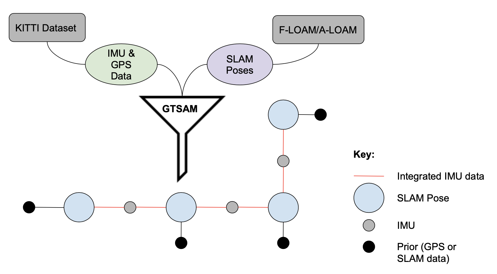

# Robust Pose Optimization for SLAM Algorithms using Multi-Sensor Fusion (RoPoSLAMS)

## Objective

Autonomous Vehicles (AVs) often operate in complex environments and need to create high quality maps with accurate poses. Keeping these challenges in mind, we aimed to improve estimation accuracy for LiDAR-based SLAM algorithms. Our project was inspired by [GTSAM](https://gtsam.org/), [F-LOAM](https://github.com/wh200720041/floam), and [A-LOAM](https://github.com/HKUST-Aerial-Robotics/A-LOAM). 

## Getting Started

### Prerequisites

 #### Ubuntu 20.04
  This was the system used to test our program.

 #### Eigen Library (C++) 
  This library helps us perform mathematical operations necessary for processing and analyzing data from GTSAM, FLOAM, and ALOAM.
  It can be installed following the [Eigen wiki](http://eigen.tuxfamily.org/index.php?title=Main_Page#Download).

 #### matplotlib-cpp
  This library helps us visualize our data analysis and resembles the plotting API used in matplotlib for Python. To install this library, visit [this](https://github.com/lava/matplotlib-cpp).

 #### Georgia Tech Smoothing and Mapping (GTSAM) Toolbox
  To build GTSAM from source, clone or download the latest release from the [GTSAM Github repo](https://github.com/borglab/gtsam). To understand GTSAM mathematical implemenation, visit this [tutorial](https://gtsam.org/tutorials/intro.html).

### Clone repository recursively:

  Since RoPoSLAMS uses FLOAM and ALOAM on the backend to generate datasets, it is necessary to have these cloned on your machine.
  Using the recurisve clone command below, your machine will clone our RoPOSLAMS codebase, as well as the necessary parts of FLOAM and ALOAM needed to run the program. 

```
  git clone --recurse-submodules git@github.com:hanpar/eecs568-group17-project.git
```

### Building and running the code:

Once you have cloned RoPoSLAMS to your machine, navigate to that folder where RoPoSLAMS is located and run the following code:
```
  cd pose_optimization
  mkdir build && cd build
  cmake ..
  make
  ./pose_optimization
```

## Our Process

This figure shows the visual representation of our algorithm where KITTI dataset is used to obtain IMU and GPS data while F-LOAM/A-LOAM are used to extract SLAM poses. We then used IMU as edges and SLAM poses as node for the factor graph that we construct. To add robustness and better accuracy, we used GPS data as priors for every node.



## References 

- [GTSAM](https://gtsam.org/)
- FLOAM
  - [Code](https://github.com/wh200720041/floam)
  - [Paper](https://arxiv.org/pdf/2107.00822.pdf)
- ALOAM
  - [Code](https://github.com/HKUST-Aerial-Robotics/A-LOAM)
- LOAM
  - [Code](https://github.com/laboshinl/loam_velodyne)
  - [Paper](https://www.ri.cmu.edu/pub_files/2014/7/Ji_LidarMapping_RSS2014_v8.pdf)
- [KITTI Dataset](http://www.cvlibs.net/datasets/kitti/)

## Created at University of Michigan - Ann Arbor as part of ROB 530.
The Team: [Boxi Jiang](mailto:boxij@umich.edu), [Nikhil Punshi](mailto:npunshi@umich.edu), [Vishrut Kaushik](mailto:vishrutk@umich.edu), [Yueh-Lin Tsai](mailto:yuehlint@umich.edu), and [Hannah Parrish](mailto:hjpa@umich.edu).

### Acknowledgements
Special thanks to Professor Maani Ghaffari Jadidi and the ROB 530: Mobile Robotics Graduate Student Instructors for supporting our project and providing guidance in accomplishing a challenging task. 